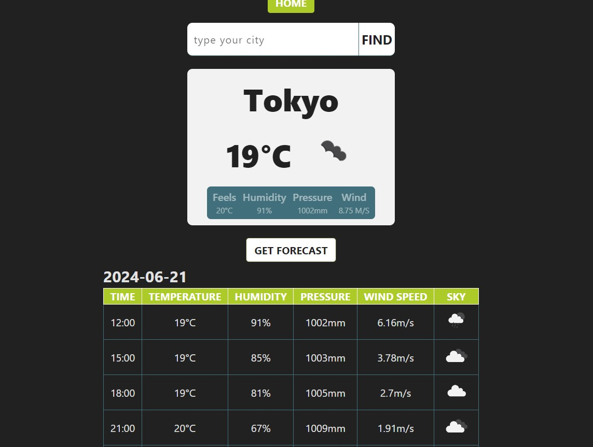

# Weather Application

This is a React application that displays the weather information based on the user's current geolocation or a manually entered location. The application shows the weather forecast for the next 5 days.

## Features

Display current weather based on user's geolocation.
Allow manual input of a city to display weather information.
Show weather forecast for the next 5 days.
Display weather details including temperature, pressure, and wind speed.

## Technology stack

React.js
